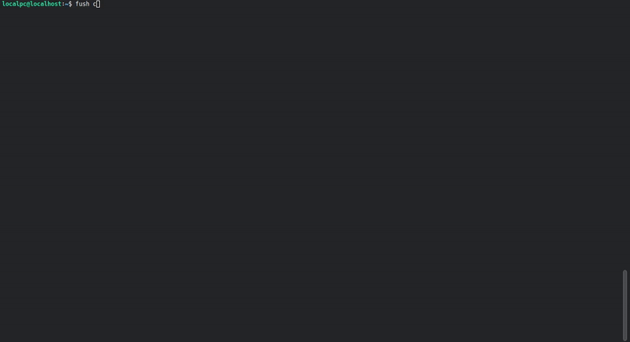
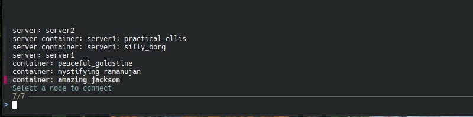
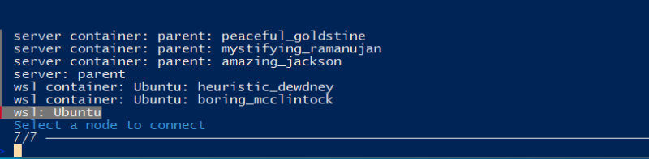

# Fush

Fush is a CLI based shell connection manager that allows you to connect to SSH, container, and WSL shells in one place

## # Table of Contents

* [Overvew](#-overview)
* [Installation](#-installation)
* [Build from source](#-build-from-source)
* [Usage](#-usage)
    * [Add server](#add-server)
    * [Edit server](#edit-server)
    * [Delete server](#delete-server)
    * [Connect](#connect)
    * [Show key](#show-key)
    * [Show info](#show-info)
    * [Scan server for container](#scan-server-for-container)
    * [Scan all server for container](#scan-all-server-for-container)

## # Overview

#### Quick demo
Using `fzf` as a selector with its fuzzy finder feature makes searching through many available connections more convenient



<br>

On **linux** it will show
* Saved server
* Saved docker container inside server (after using scan function)
* running local docker container 



<small><i>linux example</i></small>

<br>

On **windows** it will show
* saved server
* saved docker container inside server (after using scan function)
* running local docker container
* installed wsl
* running docker inside wsl (wsl distro state must running)



<small><i>windows example</i></small>

## # Installation
These are the requirements for using **Fush**:
* fzf
* ssh
* ssh-keygen
* sqlite3
* docker (optional)
* **windows only:** wsl (optional)

*Note: All of the requirements must be executable on the command line*

To install Fush, download the release binary archive, extract, and run these commands to make the application available as a command

#### Linux :
```
sudo chmod +x <full-path-to-the-extracted-fush-location>/fush

sudo ln -sf <full-path-to-the-extracted-fush-location>/fush /usr/local/bin/fush
```


Data will be stored in user config directory `~/.config/fush`

SSH key will be stored in `~/.ssh`

#### Windows :
Requires PowerShell to be run as Administrator
```
$dir = "<full-path-to-the-extracted-fush-location>\fush.exe"

$path = [Environment]::GetEnvironmentVariable("Path", "Machine")

if (($path -split ";") -notcontains $dir) { [Environment]::SetEnvironmentVariable("Path", $path.TrimEnd(";") + ";" + $dir, "Machine") }
```

Data will be stored in user config directory `C:\Users\<user>\AppData\Roaming\fush`

SSH key will be stored in `C:\Users\<your-username>\.ssh`

<br>

Check the installation by opening a new terminal and run
```
fush --version
```

## # Build from source

These are the requirements for building **Fush**:
* fzf
* ssh
* ssh-keygen
* sqlite3
* docker (optional)
* rustc >= 1.90.0
* cargo => 1.90.0
* C build toolchain e.g: 

    | Distro/OS | Package |
    |---|---|
    | Debian / Ubuntu | `sudo apt install build-essential` |
    | Arch | `sudo pacman -S base-devel` |
    | Fedora | `sudo dnf group install development-tools` |
    | RHEL / Rocky / AlmaLinux | `sudo dnf group install "Development Tools"` |
    | Alpine | `sudo apk add build-base` |
    | openSUSE | `sudo zypper install patterns-devel-base-devel_basis` |
    | Windows | MSVC Build Tools |

*Note: All of the requirements must be executable on the command line*

### Build
```
cargo build --release
```
After build is finished the released dir should be in `./target/release` *(linux)* or `.\target\release` *(windows)*. Follow the [installation](#-installation) guide  to make it  available as command

Or you could build fush with the installer script `install.sh` *(linux)* or `install.bat` *(windows)*, it will execute build command and try to copy the binary file into `/usr/local/bin` *(linux)* or `C:\Program Files\fush` *(windows)* and then also try to make it available as command. *(You still need to install the build requirements manually)*

## # Usage
### Add server
To add new server run :
```
fush add 
```
or
```
fush a
```
When asked for a key name, you can use Tab to autocomplete with the names of available keys in the SSH key directory

If the key name does not exist, a new key will be generated. Also you can't use theese names as key name:
* config
* known_hosts
* known_hosts.old
* authorized_keys
* authorized_keys2
* environment
* rc

### Edit server
To edit server run :
```
fush edit
```
or
```
fush e
```

The key name rules are the same with add server

### Delete server
To delete multiple servers run :
```
fush delete
```
or
```
fush d
```

You can choose multiple servers by toggling the marker with Shift+Tab

*Note: The key used by the deleted server will not be deleted*

### Connect
To start connection run :
```
fush connect
```
or
```
fush c
```

Only running containers will be included in the list

### Show key
To show public key content used by server run :
```
fush show-key
```
or
```
fush sk
```

### Show info
To show info like host, port, image used by container etc of a node run :
```
fush show-info
```
or
```
fush si
```

### Scan server for container
To scan containers inside multiple servers run :
```
fush scan
```
or
```
fush s
```

You can choose multiple servers by toggling the marker with Shift+Tab

*Note: Only running containers will be saved*

### Scan all server for container
To scan containers inside all of saved servers run :
```
fush scan-all
```
or
```
fush S
```
*Note: Only running containers will be saved*